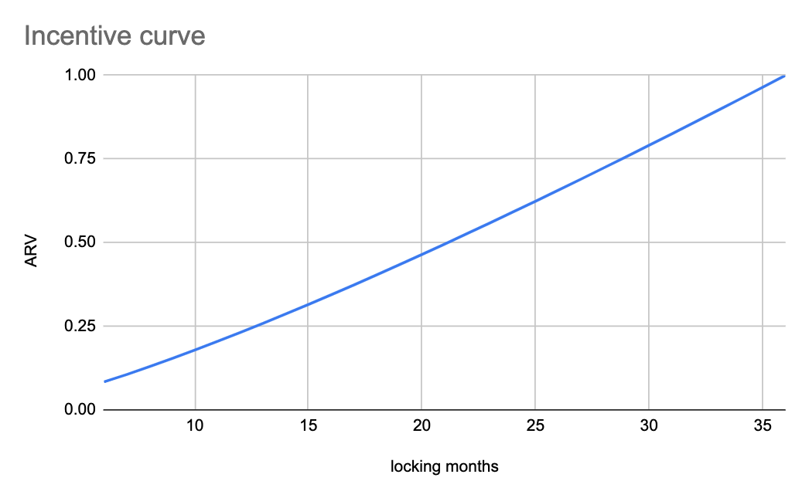

# ARV (Active Rewards Vault)

## What is the Active Rewards Vault (ARV)?

Auxo Active Reward Vault Token (ARV) is a non-transferrable ERC-20 token that is minted by staking AUXO for a period of between 6 to 36 months.

ARV holders are the responsible for decision making in the Auxo DAO. ARV holders create and vote on proposals to govern the DAO and allocate capital. As a reward for their efforts, ARV holders are able to receive the maximum earnings from the DAO’s treasury farming operations, as compared to PRV holders, however to do so they _**must**_ actively participate in governance.

Finally, ARV holders can **boost** their rewards by maintaining a longer lock length for their staked Auxo.

## Who is ARV for?

* Users interested in active participation within DAO governance.
* Participants with longer time preferences - users looking for shorter horizons should consider Auxo Passive Rewards Vault (PRV).
* Stakers looking to absolutely maximise rewards.

## The ARV Incentive Curve

***

The relationship between Auxo and ARV can be expressed by an _**incentive curve -**_ how much ARV you get for each Auxo token staked.

More ARV is minted per AUXO staked _if the stake is longer_, with the maximum amount of ARV being given to stakers who lock Auxo for the full 36 months.

_💡 The equation governing the conversion is:_

$$
ARV = AUXO \times \frac {x} {\bar{k} \times log_{10}(x)} \quad \forall x \in [6..36]
$$

_Where `x` represents the staking time in months, and `k` is set to the constant value `56.0268900276223`_

Visualised, the ARV curve (y) looks like the chart below:

<figure><figcaption></figcaption></figure>

For each AUXO deposited, the number of ARV will depend on the number of months:

* 1 ARV is minted for every Auxo staked for the maximum 36 month lock
* 1 ARV is minted for every \~13 Auxo staked for the minimum 6 month lock

## Understanding _Reward Levels_

ARV Rewards can be _boosted_ to higher _**Reward Levels**_ by restaking a user’s AUXO deposit. Reward Levels scale from level 0 (6 months until unstake) to level 30 (36 months until unstake). Maximum rewards are earned at level 30 - a 12x rewards boost versus level 0.

As time passes, a user’s Reward Level declines as their unlock date approaches. To earn the highest possible rewards, ARV stakers should therefore continually restake to the maximum 36 months.

| Months Remaining | Reward Level | Boost    | Rewards vs Max |
| ---------------- | ------------ | -------- | -------------- |
| 36               | 30           | 12.0000  | 100.00%        |
| 35               | 29           | 11.5750  | 96.46%         |
| 34               | 28           | 11.1526  | 92.94%         |
| 33               | 27           | 10.7329  | 89.44%         |
| 32               | 26           | 10.3161  | 85.97%         |
| 31               | 25           | 9.9021   | 82.52%         |
| 30               | 24           | 9.4912   | 79.09%         |
| 29               | 23           | 9.0834   | 75.69%         |
| 28               | 22           | 8.6788   | 72.32%         |
| 27               | 21           | 8.2775   | 68.98%         |
| 26               | 20           | 7.8796   | 65.66%         |
| 25               | 19           | 7.4854   | 62.38%         |
| 24               | 18           | 7.0948   | 59.12%         |
| 23               | 17           | 6.7082   | 55.90%         |
| 22               | 16           | 6.3255   | 52.71%         |
| 21               | 15           | 5.9471   | 49.56%         |
| 20               | 14           | 5.5732   | 46.44%         |
| 19               | 13           | 5.2039   | 43.37%         |
| 18               | 12           | 4.8394   | 40.33%         |
| 17               | 11           | 4.4802   | 37.33%         |
| 16               | 10           | 4.1264   | 34.39%         |
| 15               | 9            | 3.7785   | 31.49%         |
| 14               | 8            | 3.4367   | 28.64%         |
| 13               | 7            | 3.1016   | 25.85%         |
| 12               | 6            | 2.7737   | 23.11%         |
| 11               | 5            | 2.4535   | 20.45%         |
| 10               | 4            | 2.1418   | 17.85%         |
| 9                | 3            | 1.8394   | 15.33%         |
| 8                | 2            | 1.5474   | 12.90%         |
| 7                | 1            | 1.2670   | 10.56%         |
| 6                | 0            | 1 (Base) | 8.33%          |
| <6               | -            | 0        | 0%             |

In the event a user wishes to exit their ARV position, they can simply wait for their lock to expire. Assuming an initial lock of 36 months, their rewards over the unlock period will average 44% of the rewards compared to the maximum possible boost over the period.

For this reason, _ARV makes the most sense for users who plan to stay engaged with the DAO over the long term_ - users looking for shorter investment horizons should consider PRV as an alternative with more potential exit opportunities and higher average rewards if exiting within the first few years.

## Understanding Rewards Eligibility

ARV holders are entitled to collective rewards earned by their efforts in every month in which they vote. These votes may be on-chain (via the [OpenZeppelin Governance framework](https://docs.openzeppelin.com/contracts/4.x/governance)), or using an off-chain voting service like [Snapshot.org](http://snapshot.org). In both cases, interfaces will be provided for non-technical users to cast their votes.

A cutoff block each month will be selected, votes cast after that block will be considered part of the following month.

Prior to a distribution, the DAO will gather staking and voting data for ARV from relevant sources, and construct a view of the proposed rewards distribution. This will be shared to DAO members, who will be asked to vote on the validity of the proposed distribution.

* If the distribution is **notorized** (voted as valid), the DAO will distribute rewards via a distributor contract.
* If not, the DAO will resolve any issues and resubmit a new proposal for distribution.

Rewards will be distributed in WETH and will be claimable via a rewards contract. Rewards from multiple epochs can be claimed at once, there is no need for stakers to claim every month.

<figure><figcaption></figcaption></figure>

## Early exit to PRV

PRV stands for The Passive Rewards Vault. ARV holders can, at any point, choose to convert their ARV to PRV via the _**Early Termination**_ mechanism.

PRV is redeemable for Auxo, but subject to **redemption restrictions** based on the value of Auxo versus NAV (see the [prv-passive-rewards-vault.md](prv-passive-rewards-vault.md "mention") page for full details), on the other hand, PRV is **transferrable** and, as such, may offer other opportunities for exit.&#x20;

**Importantly:** converting from ARV to PRV carries an additional, one-time, termination penalty of 20% of the staked AUXO, this means:

* If Alice deposited 100 AUXO for 36 months, and received 100 ARV in return, she could terminate early at any time.
* Alice would pay the termination fee of 20%.&#x20;
* Alice would therefore receive 80 PRV after terminating early.
