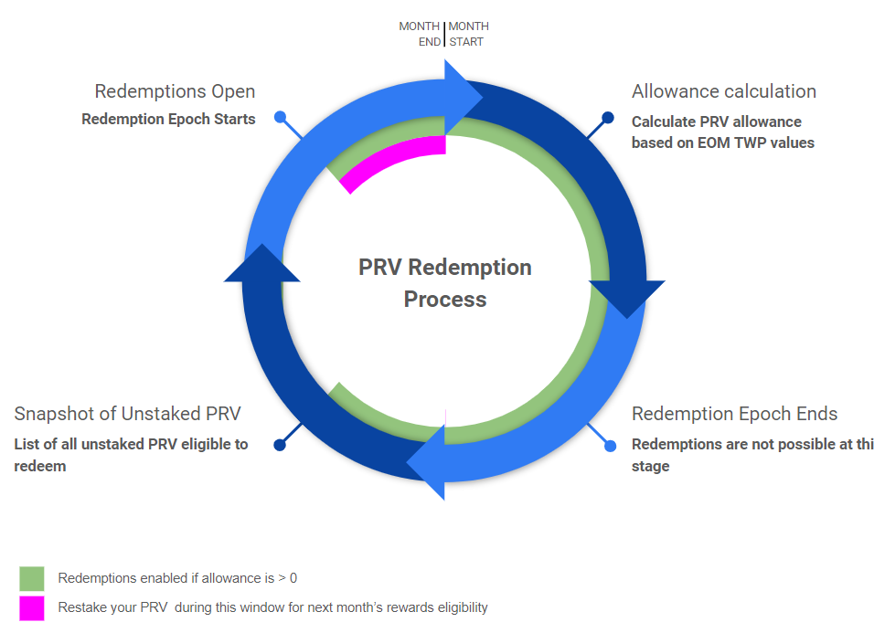

# Redeeming PRV

PRV can be redeemed for AUXO through the PRV redemption process. Redemptions are subject to an allowance, that is determined on a monthly basis and are dependent on AUXO trading at a premium over a 7-day average NAV.


The PRV redemptions allowance (budget available to be redeemed) is determined by the following [#redemption-mechanics](./#redemption-mechanics "mention") 👈 Recommended reading


PRV holders can opt to convert their unstaked PRV to AUXO when the redemption window is enabled and if the allowance is available. The amount that can be redeemed will be based on:

1. The amount of unstaked PRV the holder had in the wallet by the time of the snapshot
2. The availability of a redemption allowance on the current epoch

### The Process

1. Treasury Farming Committee calculates the 7-day TWAP and B factor to define the allowance.
2. A snapshot is taken to account for all unstaked PRV by the last block of the day previous to the redemption epoch start.
3. A new epoch is set with the defined allowance and addresses taken at the snapshot.
4. Once the epoch tx is executed, the allowance will be available for redemption.

<figure><figcaption></figcaption></figure>

### How to



### Considerations

* Allowance availability is not guaranteed, as it’s subject to market conditions and can result in values equal to or higher than zero.
* The process actions are scheduled using UTC timezone time and dates.
* PRV redemptions can be claimed on a first-come, first-served basis.
* The unstaked PRV snapshot is taken on the last block of the day previous to the Redemption epoch start. (e.g.: if opened on May 31st, it’d be the last block of May 30th).
* The allowance is calculated after the snapshot is taken and communicated when the PRV epoch starts.
* The PRV redemption allowance will be available for claiming until it runs out, or until the epoch ends (scheduled to be closed on the day of the next snapshot).
* Those users unable to redeem their PRV and willing to be eligible for the next month’s rewards should consider staking their tokens before the next Epoch starts (before the last block of the Redemption Day)


PRV tokens needs to be staked for en entire epoch (month) in order to be eligible for rewards distribution (see [#how-staking-works-in-prv](./#how-staking-works-in-prv "mention")). Unstaking PRV in order to qualify for the redemption snapshot may cause holders to not be iligible for rewards for the same epoch

